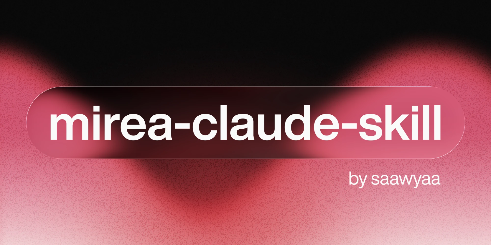

<p align="center">
  
</p>

<p align="center">
  Учёба в РТУ МИРЭА одной командой: дедлайны, расписание, посещаемость и баллы БРС<br>
  из <b>СДО</b> и <b>Пульса</b> — в одну короткую сводку.
</p>

<p align="center">
  <a href="https://github.com/saawyaa/mirea-claude-skill/releases"></a>
  <a href="#лицензия"></a>
  <a href="#установка"></a>
</p>

```
🔥 СРОЧНО (< 48 ч)
  27.09 23:58 (через 6 дн.) · Рабочая тетрадь 3 · Информатика · НЕ СДАНО
📍 СЕГОДНЯ пн 21.09
  14:20 ПР Физика · А-107-1
  16:20 ЛК Математический анализ · А-10 · Муханов С. А.
💸 ПРОПУСКИ СТОИЛИ 2.7 балла
  Иностранный язык · 1 пара · −1.33
  История России · 1 пара · −1.33
БРС · Информатика  ЭКЗ  ▰▱▱▱▱▱▱▱▱▱  2.5/120  до «3»: ещё 37.5
```

## Установка

```
/plugin marketplace add saawyaa/mirea-claude-skill
/plugin install mirea@mirea-claude-skill
```

Настраивать нечего: ни токенов, ни ключей, ни конфигов. Обновления приходят через `/plugin`.

<details>
<summary>Без плагинов, вручную</summary>

```bash
git clone https://github.com/saawyaa/mirea-claude-skill ~/.claude/skills/mirea
```
</details>

> [!NOTE]
> При первом запуске откроется панель браузера с формой входа МИРЭА. **Логин и пароль вводишь сам** — Claude их не касается. Пульс подхватится следом без повторного входа: SSO общий.

## Что умеет

| Спросить | Получить |
|---|---|
| «сводка» | дедлайны, пары и посещаемость сразу |
| «дедлайны», «что задали» | сроки с реальным статусом сдачи, а не догадками |
| «что там в тетради 3» | условие задания, файлы, материалы курса рядом |
| «расписание», «что сегодня» | пары с аудиториями и преподавателями |
| «баллы», «БРС» | сколько набрано и сколько осталось до порога |
| «посещаемость» | отметки и во сколько баллов обошлись пропуски |
| «что есть в проектной зоне» | оборудование, часы работы, свои брони |
| «не работает» | самодиагностика одним вызовом |

Ответ по умолчанию — компактный текст: колонки выровнены, у баллов полоса прогресса, у сроков «через сколько дней». По запросу «покажи наглядно» то же самое рисуется виджетом в чате.

Второй запуск показывает **только изменения**: `✓ сдано`, `★ оценили`, `+ новый срок`, `↑ баллы выросли`.

## Границы

> [!IMPORTANT]
> Скилл **не вводит пароли** и **ничего не сдаёт и не отправляет** без явного подтверждения в чате. Список группы с почтами однокурсников не выгружается: это персональные данные других людей.

> [!WARNING]
> «Н» в журнале — это **отсутствие отметки, а не доказанный прогул**: она могла просто не сработать. Скилл так и говорит и не пугает раньше времени.

> [!NOTE]
> Фонового автодайджеста по расписанию нет. Без токена нужна живая сессия браузера, поэтому сводка собирается только по запросу.

<details>
<summary><b>Как это устроено</b></summary>

<br>

СДО — это Moodle с авторизацией через Keycloak. Токены веб-сервисов студентам не выдают, а `login/token.php` не работает с SSO-аккаунтами. Поэтому скилл ходит в тот же внутренний API через `sesskey` живой сессии браузера — ровно так, как это делает сама страница СДО.

Пульс работает на gRPC-web, поэтому читается через DOM.

**Вся агрегация выполняется внутри страницы**, наружу возвращается готовый короткий текст. Это сделано ради расхода токенов подписки: одна сводка вместо десятка сырых JSON-ответов. Коллектор кэширует сам себя в `localStorage`, поэтому повторный вызов в той же сессии стоит одну строку.

Память о прошлом запуске живёт на диске, в `~/.local/state/mirea/` — `localStorage` очищается вместе с панелью браузера.

Сроки показываются по Москве независимо от часового пояса машины: их выставляет университет, а не ноутбук.

</details>

<details>
<summary><b>Что проверено, а что нет</b></summary>

<br>

Всё перечисленное работает на живом аккаунте студента первого курса ИИТ.

**Не обкатано:** сравнение «с прошлого раза» на реальном изменении баллов — за время разработки они не успели поменяться, логика проверялась на подменённых снимках.

**Может отличаться у других:** структура БРС (0–40 / 0–20 / 0–10 / 0–40, сумма 0–120) снята с курсов первого курса; физкультура уже идёт из 15. Английский интерфейс Moodle проверен только на странице задания, Пульс по-английски не проверялся вовсе.

**Источники расходятся — и это нормально.** По БРС источник истины Пульс: ведомость курса в Moodle преподаватель может не вести. Проверено на живом курсе, где Пульс показывал начисленные баллы, а таблица в СДО была пустой целиком. При расхождении скилл верит Пульсу и говорит об этом вслух.

</details>

## Лицензия

MIT — см. [LICENSE](LICENSE).
